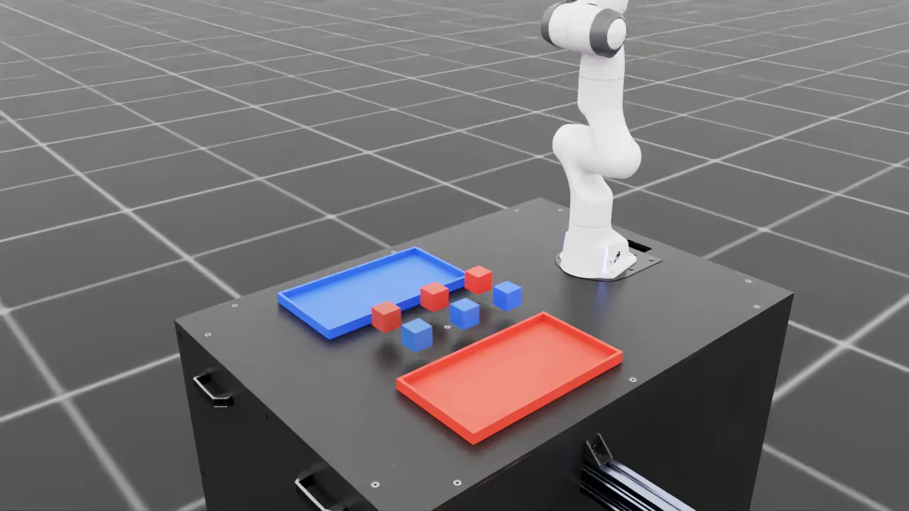

# Franka Robot Harness

基于 Isaac Sim / Isaac Lab 的 Franka 机械臂仿真项目。将自然语言指令转成有序技能计划，调用状态机、PPO 抬升策略和 ROS 2 关节轨迹控制；根据实际仿真状态判断每步是否完成。

## 演示

**顺序指令与跨盘搬运**

https://github.com/user-attachments/assets/496d2b6d-5df6-4b85-9f9d-34cafd412673

**六物块按颜色整理**

https://github.com/user-attachments/assets/7421d41b-75b4-4c40-bf85-aeb917f78d8c

**PPO 抬升与状态机放置**

https://github.com/user-attachments/assets/f6876a47-3030-48ba-94c2-03da4cb092f3

**失败复现：重复搬运**

https://github.com/user-attachments/assets/abd09843-65fe-464f-917d-d4c119b8fed7

## 结果

| 测试 | 结果 |
| --- | --- |
| 10 类语言任务 × 3 个布局种子 | 计划正确 30/30；完整物理任务成功 23/30 |
| 状态机随机化抓放 | 32/32 成功 |
| PPO 抬升与空中目标到达 | 独立评测 100/100 成功 |
| 7 关节、4 路点轨迹 | 最大终点误差约 0.015 rad |
